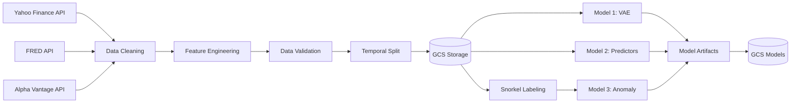
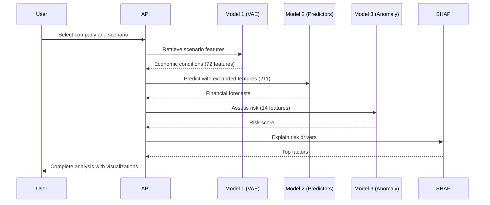

# Financial Stress Test Platform

[](https://www.python.org/downloads/)
[](https://opensource.org/licenses/MIT)
[]()

## This MLOps Project focuses on generating realistic economic scenarios and predict company financial vulnerability using a production-grade MLOps pipeline with automated drift detection and continuous deployment.

---

## Table of Contents

- [Overview](#overview)
- [Key Features](#key-features)
- [Architecture](#architecture)
- [System Flow](#system-flow)
- [Installation](#installation)
- [Quick Start](#quick-start)
- [Usage Guide](#usage-guide)
- [CI/CD Pipeline](#cicd-pipeline)
- [Monitoring & Drift Detection](#monitoring--drift-detection)
- [API Documentation](#api-documentation)
- [Project Structure](#project-structure)
- [Model Details](#model-details)
- [Contributing](#contributing)
- [License](#license)

---

## Overview

### What is This?

A **complete MLOps platform** that helps financial analysts, portfolio managers, and risk teams:

1. **Generate** unlimited realistic economic stress scenarios (recession, stagflation, market crash)
2. **Predict** how companies perform under each scenario (revenue, profits, debt levels)
3. **Identify** which companies are at high risk with explainable AI
4. **Automatically retrain** models when performance degrades
5. **Visualize** results in an interactive dashboard

### Why It Matters

- **Time Savings**: Portfolio stress testing from 2 days → 2 minutes (99.9% reduction)
- **Accuracy**: 82% ROC-AUC in identifying at-risk companies
- **Automation**: 100% automated training, validation, and deployment
- **Explainable**: SHAP values show WHY a company is at risk
- **Adaptive**: Weekly drift detection ensures models stay accurate

---

## Key Features

### Three-Model ML Pipeline

```
Model 1: VAE          →  Model 2: Predictors   →  Model 3: Anomaly
Scenario Generator       Financial Forecasts      Risk Assessment

72 features              211 features             14 features
Generates scenarios      Predicts: Revenue,       Outputs: 0-100 risk
(GDP, VIX, Unemp)       EPS, Debt, Margin,       + SHAP explanations
                        Stock Return
```

### Full MLOps Automation

- **Continuous Integration**: Tests on every code push
- **Continuous Deployment**: Automatic model training & deployment
- **Drift Detection**: Weekly monitoring with auto-retraining
- **Model Versioning**: All models tracked with timestamps & backups
- **Experiment Tracking**: MLflow logs all training runs

### Production-Ready API

- **FastAPI Backend**: RESTful endpoints with auto-generated docs
- **Cloud Deployment**: Google Cloud Run with auto-scaling
- **Docker Container**: Reproducible deployment environment
- **Authentication**: Secure access with API keys
- **Monitoring**: Real-time performance metrics

### For Business Users

- **Unlimited Scenarios**: Generate 100+ stress scenarios (not limited to historical crises)
- **Fast Analysis**: Test entire portfolio in minutes (vs days manually)
- **Clear Explanations**: See exactly WHY each company is at risk
- **Visual Dashboard**: Interactive charts, risk gauges, heatmaps
- **Portfolio Analysis**: Test multiple holdings simultaneously

### For Data Scientists

- **Production MLOps**: Complete CI/CD with 5 automated workflows
- **Drift Detection**: Weekly monitoring with automated retraining
- **Model Selection**: Automatic selection of best model per target
- **Experiment Tracking**: MLflow integration for reproducibility
- **Bias Detection**: Sector-specific performance monitoring
- **Explainability**: SHAP values for regulatory compliance

### For DevOps

- **Containerized**: Docker deployment (runs anywhere)
- **Cloud Native**: Google Cloud Platform integration
- **Auto-Scaling**: Handles 1-100 concurrent users automatically
- **Secure**: GCS authentication, API key management
- **Monitored**: Cloud Monitoring with custom metrics

---
## Architecture

### Complete System Architecture


### System Architecture Overview

Our MLOps platform is built on **five integrated layers** that work together to provide automated stress testing:

**Layer 1: Data Pipeline**
Collects data from multiple sources (Yahoo Finance, FRED API, Alpha Vantage), performs cleaning and merging, engineers features, validates data quality, and stores processed data in Google Cloud Storage using Airflow DAG orchestration.

**Layer 2: Model Training Pipeline**
Trains three specialized models independently with MLflow experiment tracking, stores trained models as artifacts in GCS:
- **Model 1 (VAE)**: Generates economic stress scenarios
- **Model 2 (Predictors)**: Forecasts 5 financial targets
- **Model 3 (Anomaly Detection)**: Assesses company risk

**Layer 3: CI/CD Pipeline**
Automates the entire workflow with two trigger types:
- **Code Push**: Continuous integration tests, followed by model-specific CD workflows
- **Scheduled (Sunday 2 AM)**: Drift monitoring checks model health
- **Decision Logic**: If drift detected → auto-retrain, if no drift → continue monitoring
- **Deployment**: Updates models in GCS, API auto-loads new versions

**Layer 4: Monitoring & Alerts**
Tracks system health in real-time:
- **Structured Logs**: Records all system events
- **Prometheus Metrics**: Monitors performance indicators
- **Evidently Drift Check**: Statistical distribution analysis
- **Grafana Dashboard**: Visual monitoring interface
- **Alert System**: Notifications when drift detected or models retrained

**Layer 5: API & Deployment**
Serves predictions to end users:
- **Model Loader**: Downloads models from GCS on startup
- **Data Fetcher**: Retrieves company information
- **Feature Mapper**: Transforms data between model formats
- **Stress Test Pipeline**: Orchestrates three-model inference
- **SHAP Explainer**: Generates risk factor explanations
- **FastAPI**: Provides REST endpoints
- **Docker + GCP Cloud Run**: Containerized, auto-scaling deployment
- **Dashboard**: Interactive web interface for end users

**Monitoring**
- **Evidently Drift Check**: Statistical distribution analysis
- **Grafana Dashboard**: Visual monitoring interface
- **Alert System**: Notifications when drift detected or models retrained

---

## System Flow

### Complete Request-Response Flow

```
┌──────────────────────────────────────────────────────────────────────────┐
│                    USER INTERACTION                                      │
│  User selects: Company (Ford) + Scenario (Severe Recession)              │
└───────────────────────────────┬──────────────────────────────────────────┘
                                │
                                ↓
┌───────────────────────────────────────────────────────────────────────────┐
│                         STEP 1: SCENARIO LOOKUP                           │
│  Retrieve pre-generated scenario #1:                                      │
│    • GDP: $14,500B (-3.2% decline)                                        │
│    • VIX: 38 (market panic)                                               │
│    • Unemployment: 10.2%                                                  │
│    • ... 69 more macro features                                           │
└───────────────────────────────┬───────────────────────────────────────────┘
                                │
                                ↓
┌───────────────────────────────────────────────────────────────────────────┐
│                    STEP 2: FEATURE MAPPING                                │
│  FeatureMapper expands 72 → 211 features:                                 │
│    • Direct: GDP → GDP_last                                               │
│    • Derived: VIX → vix_q_mean, vix_q_max, vix_q_std                      │
│    • Company: Add Revenue, Debt, Margins from database                    │
│  Result: 211 features ready for Model 2                                   │
└───────────────────────────────┬───────────────────────────────────────────┘
                                │
                                ↓
┌───────────────────────────────────────────────────────────────────────────┐
│                   STEP 3: FINANCIAL PREDICTIONS                           │
│  Model 2 (5 LightGBM models) predicts:                                    │
│    • Revenue: $26.2B (currently $34.5B) → -24%                            │
│    • EPS: $0.08 (currently $0.55) → -85%                                  │
│    • Debt/Equity: 4.9 (currently 3.8) → +29%                              │
│    • Profit Margin: 0.9% (currently 4.2%) → -79%                          │
│    • Stock Return: -46%                                                   │
└───────────────────────────────┬───────────────────────────────────────────┘
                                │
                                ↓
┌───────────────────────────────────────────────────────────────────────────┐
│                   STEP 4: RISK ASSESSMENT                                 │
│  Extract 14 key features:                                                 │
│    • 7 Macro (from scenario): GDP, VIX, Unemployment, etc.                │
│    • 7 Company (current): Revenue, Debt, Margins, etc.                    │
│                                                                           │
│  Model 3 (One-Class SVM) analyzes:                                        │
│    → Anomaly Score: -2.3 (negative = at-risk)                             │
│    → Risk Score: 78/100 (HIGH RISK)                                       │
└───────────────────────────────┬───────────────────────────────────────────┘
                                │
                                ↓
┌───────────────────────────────────────────────────────────────────────────┐
│                 STEP 5: EXPLAINABILITY (SHAP)                             │
│  Why is Ford at 78/100 risk?                                              │
│    1. High Debt (3.8x equity) → +25 points (32%)                          │
│    2. GDP Decline (-3.2%) → +18 points (23%)                              │
│    3. Unemployment (10.2%) → +15 points (19%)                             │ 
│    4. Low Margins (4.2%) → +12 points (15%)                               │
│    5. Cyclical Sector (Auto) → +8 points (11%)                            │
└───────────────────────────────┬───────────────────────────────────────────┘
                                │
                                ↓
┌───────────────────────────────────────────────────────────────────────────┐
│                        STEP 6: RESPONSE                                   │
│  JSON returned to dashboard:                                              │
│    {                                                                      │
│      "company_id": "F",                                                   │
│      "risk_score": 78,                                                    │
│      "risk_category": "HIGH",                                             │
│      "predictions": {...},                                                │
│      "shap_explanations": [...]                                           │
│    }                                                                      │
│                                                                           │
│  Total Time: 1.5 seconds                                                  │
└───────────────────────────────────────────────────────────────────────────┘
```

---

## Architecture of our Pipelines

### Data Pipeline Architecture



### Three-Model Inference Pipeline



---

## Installation

### Prerequisites

- Python 3.10 or higher
- Google Cloud Account (free tier available)
- Git for cloning repository
- Docker (optional, for containerized deployment)

### Getting Started

#### Step 1: Clone the Repository

```bash
git clone https://github.com/Novia-Dsilva/Mlops_Project_FinancialCrises.git
cd Mlops_Project_FinancialCrises
```

#### Step 2: Set Up Python Environment

Create virtual environment:
```bash
python3.10 -m venv venv
```

Activate virtual environment:

For Linux/Mac:
```bash
source venv/bin/activate
```

For Windows:
```bash
venv\Scripts\activate
```

#### Step 3: Install Dependencies

```bash
pip install --upgrade pip
pip install -r requirements.txt
```

Verify installation:
```bash
python -c "import tensorflow, lightgbm, fastapi; print('All packages installed')"
```

#### Step 4: Configure Google Cloud

Install Google Cloud SDK (if not already installed):
- Visit: https://cloud.google.com/sdk/docs/install

Authenticate with GCP:
```bash
gcloud auth login
gcloud config set project ninth-iris-422916-f2
gcloud auth application-default login
```

Verify GCS access:
```bash
gsutil ls gs://mlops-financial-stress-data/
```

#### Step 5: Verify Models

Check that all models exist in GCS:
```bash
cd deployment/api
python verify_gcs_models.py
```

Expected output:
```
✓ MODEL 1: VAE Scenario Generator
✓ MODEL 2: Predictive Models (5 targets)
✓ MODEL 3: Anomaly Detection
✓ ALL REQUIRED MODELS VERIFIED
```

#### Step 6: Start the API Backend

From the deployment/api directory:
```bash
python main.py
```

Wait for startup (60 seconds):
```
Loading models from GCS...
✓ Model 1 loaded
✓ Model 2 loaded  
✓ Model 3 loaded
Loading company data...
✓ API READY
Uvicorn running on http://0.0.0.0:8000
```

#### Step 7: Open the Dashboard

In a new terminal window:
```bash
cd deployment/dashboard
python -m http.server 8080
```

Open your browser:
- Dashboard: http://localhost:8080
- API Documentation: http://localhost:8000/docs
- Health Check: http://localhost:8000/api/v1/health

**Your platform is now running locally!**

---

### Docker Deployment (Alternative)

#### Build and Run with Docker

Build the container:
```bash
docker build -t financial-stress-api -f deployment/docker/Dockerfile.api .
```

Run the container:
```bash
docker run -p 8000:8000 \
  -v ~/.config/gcloud:/root/.config/gcloud:ro \
  financial-stress-api
```

Or use Docker Compose:
```bash
cd deployment/docker
docker-compose up -d
```

---

### Cloud Deployment (Production)

#### Deploy to Google Cloud Run

Build and push image:
```bash
gcloud auth configure-docker
docker build -t gcr.io/ninth-iris-422916-f2/financial-stress-api .
docker push gcr.io/ninth-iris-422916-f2/financial-stress-api
```

Deploy to Cloud Run:
```bash
gcloud run deploy financial-stress-api \
  --image gcr.io/ninth-iris-422916-f2/financial-stress-api \
  --platform managed \
  --region us-central1 \
  --allow-unauthenticated \
  --memory 8Gi \
  --cpu 2 \
  --timeout 300 \
  --max-instances 10
```

---

## Quick Start

### Generate Scenarios

```bash
# Using curl
curl -X POST http://localhost:8000/api/v1/scenarios/generate \
  -H "Content-Type: application/json" \
  -d '{"n_scenarios": 100}'

# Response:
# {
#   "message": "Generated 100 scenarios",
#   "scenarios": [
#     {"scenario_id": 1, "severity": "severe", "sigma": 2.5},
#     ...
#   ]
# }
```

### Run Stress Test

```bash
# Test Ford Motor Company in severe recession
curl -X POST http://localhost:8000/api/v1/stress-test \
  -H "Content-Type: application/json" \
  -d '{
    "company_id": "F",
    "scenario_ids": [1]
  }'

# Response:
# {
#   "company_id": "F",
#   "risk_score": 78,
#   "risk_category": "HIGH",
#   "predictions": {
#     "predicted_revenue": 26200000000,
#     "revenue_change_pct": -24,
#     ...
#   },
#   "shap_explanations": [
#     {"feature": "Debt_to_Equity", "shap_value": 25, ...},
#     ...
#   ]
# }
```

### List Available Companies

```bash
curl http://localhost:8000/api/v1/companies

# Response:
# {
#   "companies": [
#     {"company_id": "AAPL", "sector": "Technology"},
#     {"company_id": "F", "sector": "Automotive"},
#     ...
#   ],
#   "total": 847
# }
```

---

### Usage Guide

### Using the Dashboard

> View our dashboard here: https://storage.googleapis.com/mlops-financial-stress-ui/login.html

#### 1. Generate Scenarios

- Navigate to **"Generate Scenarios"** tab
- Select number of scenarios (10, 50, 100, or 200)
- Click **"Generate Scenarios"**
- View generated scenario cards showing economic indicators (GDP, VIX, Unemployment)

#### 2. Run Company Stress Test

- Navigate to **"Stress Test"** tab
- Select company from dropdown
- Select scenario to test
- Click **"Run Stress Test"**
- View results:
  - **Risk Gauge**: Visual meter showing risk score
  - **Predictions Table**: Forecasted financial metrics
  - **SHAP Chart**: Top risk drivers with contribution percentages
  - **Interpretation**: Plain-English explanation

#### 3. Analyze Portfolio

- Navigate to **"Portfolio Analysis"** tab
- Use the Companies that you want to compare from the dropdown list
- Select scenario to test against
- View portfolio analysis that shows the risk score for the companies selected

---

## CI/CD Pipeline

### Automated Workflows

#### 1. Continuous Integration (On Every Push)

```
Trigger: git push origin main
Run Time: ~5 minutes

Steps:
├─ Checkout code
├─ Install Python 3.10 + dependencies
├─ Run pytest (all unit tests)
├─ Validate Airflow DAG syntax
└─ Report status (Yes or No)

Purpose: Ensure code quality before deployment
```

#### 2. Continuous Deployment - Predictors (On Push to main)

```
Trigger: Changes in src/models/predictor/*
Run Time: ~45 minutes

Steps:
├─ Download train/val/test data from GCS
├─ Train 5 targets × 4 models = 20 models
│  ├─ LightGBM (base)
│  ├─ LightGBM (Optuna-tuned)
│  ├─ XGBoost (base)
│  └─ XGBoost (Optuna-tuned)
├─ Select best model per target (highest R²)
├─ Validate (R² > 0.75?)
├─ Upload 5 best models to GCS
└─ Send notification email

Result: New predictor models automatically deployed
```

#### 3. VAE Continuous Deployment (On Push to VAE code)

```
Trigger: Changes in src/models/vae/*
Run Time: ~30-90 minutes

Steps:
├─ Download macro_features_clean.csv from GCS
├─ Train Dense VAE (latent_dim=16)
├─ Train Ensemble VAE (5 models)
├─ Validate both models (KS statistic)
├─ Bias detection (performance by time period)
├─ Select best model (highest KS)
├─ Convert to .pkl format
├─ Upload to GCS models/vae/deployment/
└─ Send deployment confirmation

Result: New VAE deployed for scenario generation
```

#### 4. Anomaly Detection CD (On Push to anomaly code)

```
Trigger: Changes in src/models/train_anomaly_detection.py
Run Time: ~40 minutes

Steps:
├─ Download features_engineered.csv from GCS
├─ Run EDA analysis → Upload plots to GCS
├─ Extract auto thresholds → Save thresholds.json
├─ Run Snorkel labeling pipeline
│  ├─ Apply 15 labeling functions
│  ├─ Train label model
│  └─ Generate AT_RISK labels
├─ Train 3 anomaly models:
│  ├─ Isolation Forest
│  ├─ Local Outlier Factor
│  └─ One-Class SVM
├─ Select best (highest ROC-AUC)
├─ Upload ONLY best model to GCS
└─ Send training report

Result: New anomaly detector deployed
```

#### 5. Monitoring & Auto-Retraining (Weekly Schedule)

```
Trigger: Every Sunday at 2:00 AM
Run Time: ~10 minutes (no drift) or ~80 minutes (with retraining)

Steps:
├─ Download current production models from GCS
├─ Download recent data (last 90 days)
├─ Test VAE:
│  ├─ Generate scenarios
│  ├─ Calculate KS statistic
│  └─ Drift if KS < 0.70
├─ Test Anomaly Model:
│  ├─ Predict on validation set
│  ├─ Calculate ROC-AUC
│  └─ Drift if ROC < 0.75 or drop > 5%
├─ Check concept drift (correlation changes)
├─ Log metrics to Cloud Monitoring
├─ IF drift detected:
│  ├─ Trigger retraining workflows
│  ├─ Validate new models
│  ├─ Deploy ONLY if better than current
│  └─ Backup old models
├─ Send email report (drift status)
└─ Save drift report to GCS

Result: Models stay accurate automatically
```

---

## Monitoring & Drift Detection

### Weekly Monitoring Process

```
┌─────────────────────────────────────────────────────────────┐
│              SUNDAY 2:00 AM - AUTOMATED CHECK               │
└─────────────────────────────────────────────────────────────┘

STEP 1: Download Current State
├─ Production VAE from GCS
├─ Production Anomaly model from GCS
└─ Recent data (last 90 days)

STEP 2: Test VAE Performance
├─ Generate 1,000 test scenarios
├─ Compare to real data distributions
├─ Calculate KS statistic per feature
├─ Average KS: 0.79
└─ Threshold: 0.70
    → 0.79 > 0.70 -> NO DRIFT

STEP 3: Test Anomaly Model Performance
├─ Predict on recent companies
├─ Calculate ROC-AUC vs true labels
├─ Current ROC: 0.80
├─ Baseline ROC: 0.82
├─ Drop: 2.4%
└─ Threshold: ROC > 0.75 AND drop < 5%
    → Both conditions met -> NO DRIFT

STEP 4: Check Concept Drift
├─ Measure feature correlations
├─ VIX vs AT_RISK: 0.62 (was 0.65)
├─ Debt vs AT_RISK: 0.56 (was 0.58)
├─ Max change: 4.6%
└─ Threshold: Change > 30%
    → 4.6% < 30% -> NO CONCEPT DRIFT

STEP 5: Decision
├─ VAE: Healthy 
├─ Anomaly: Healthy 
├─ Concept: Stable 
└─ Action: No retraining needed

STEP 6: Log & Notify
├─ Log to Cloud Monitoring:
│  └─ custom.googleapis.com/vae/ks_statistic: 0.79
│  └─ custom.googleapis.com/anomaly/roc_auc: 0.80
├─ Save drift report to GCS
└─ Email team: "Weekly check complete - All systems healthy"
```

### Drift Detection Thresholds

| Model | Metric | Healthy Range | Drift Threshold | Action |
|-------|--------|---------------|-----------------|--------|
| VAE | KS Statistic | 0.80-1.00 | < 0.70 | Retrain VAE |
| VAE | Pass Rate | 85-100% | < 80% | Retrain VAE |
| Anomaly | ROC-AUC | 0.80-1.00 | < 0.75 | Retrain Anomaly |
| Anomaly | Performance Drop | 0-5% | > 5% | Retrain Anomaly |
| All Models | Concept Drift | Stable | Correlation Δ > 30% | Retrain affected model |

### What Happens When Drift Detected

```
┌─────────────────────────────────────────────────────────────┐
│            DRIFT DETECTED - AUTO-RETRAINING FLOW            │
└─────────────────────────────────────────────────────────────┘

2:05 AM - Alert Email Sent
├─ Subject: "Drift Detected - Retraining Started"
├─ Body: "VAE KS dropped to 0.68 (below 0.70 threshold)"
└─ Link to GitHub Actions run

2:10 AM - Retraining Begins (Automatic)
├─ Workflow: vae_continuous_deployment.yml triggered
├─ Download latest 2025 economic data
├─ Train Dense VAE (22 minutes)
├─ Train Ensemble VAE (90 minutes)
└─ Total: ~90 minutes

3:40 AM - Validation
├─ New Dense VAE: KS = 0.82
├─ New Ensemble VAE: KS = 0.84
├─ Current production: KS = 0.68
└─ Decision: Deploy Ensemble (0.84 > 0.68)

3:45 AM - Deployment
├─ Backup old model:
│  └─ gs://bucket/models/vae/backups/backup_20251212.pkl
├─ Deploy new model:
│  └─ gs://bucket/models/vae/deployment/best_model_deployment.pkl
└─ Update metadata.json

3:50 AM - Success Email Sent
├─ Subject: "Retraining Complete - Models Deployed"
├─ Body: "VAE improved: 0.68 → 0.84"
└─ Next API request uses new model automatically

TOTAL TIME: 1 hour 40 minutes (fully automatic)
RESULT: Models healthy again, drift resolved
```

---

## API Documentation


### Base URL

- **Local Development**: `http://localhost:8000`
- **Production**: Your deployed Cloud Run URL

### Available Endpoints

#### Generate Scenarios
- **Method**: POST
- **Path**: `/api/v1/scenarios/generate`
- **Purpose**: Create new economic stress scenarios

#### Run Stress Test
- **Method**: POST
- **Path**: `/api/v1/stress-test`
- **Purpose**: Analyze company risk under selected scenarios

#### List Companies
- **Method**: GET
- **Path**: `/api/v1/companies`
- **Purpose**: View all available companies

#### Health Check
- **Method**: GET
- **Path**: `/api/v1/health`
- **Purpose**: Verify API and models are loaded

### Interactive Documentation

Visit `/docs` endpoint in your browser for Swagger UI with:
- Interactive testing interface
- Request/response schemas
- Example usage
- Authentication details

---

## Project Structure

```
financial-stress-mlops/
│
├── .github/
│   └── workflows/                              # CI/CD automation
│       ├── continuous_integration.yml          # Tests on every push
│       ├── continuous_deployment.yml           # Predictor models training
│       ├── vae_continuous_deployment.yml       # VAE training
│       ├── anomaly_detection_cd.yml           # Anomaly detection pipeline
│       └── complete_monitoring_retraining.yml  # Weekly drift monitoring
│
├── src/
│   ├── data/                                   # Data collection scripts
│   │  
│   │   ├── preprocessing/                          # Data processing
│   │   ├── feature_engineering.py
│   │   ├── temporal_split.py
│   │   ├── drop_features.py
│   │   └── handle_outliers_after_split.py
│   │
│   ├── eda/                                    # Exploratory analysis
│   │   └── eda.py
│   │
│   ├── labeling/                               # Weak supervision
│   │   ├── auto_threshold_extractor.py
│   │   └── snorkel_pipeline.py
│   │
│   ├── models/                                 # Model training
│   │   ├── vae/
│   │   │   ├── Dense_VAE_optimized_mlflow_updated.py
│   │   │   └── Ensemble_VAE_updated.py
│   │   ├── predictor/
│   │   │   ├── predictor_model.py
│   │   │   ├── create_target.py
│   │   │   ├── lightgbm_model.py
│   │   │   ├── lightgbm_hyperparameter_tuning.py
│   │   │   ├── lstm_model.py
│   │   │   └── final_selection_after_bias_detection.py
│   │   ├── train_anomaly_detection.py
│   │   ├── model_validation.py
│   │   ├── bias_detection.py
│   │   └── model_selection.py
│   │
│   └── monitoring/                             # Drift detection
│       ├── model_monitor.py
│       └── gcp_monitoring_setup.py
│
├── deployment/
│   ├── api/                                    # FastAPI backend
│   │   ├── main.py
│   │   ├── pipeline.py
│   │   ├── model_loader.py
│   │   ├── feature_mapper.py
│   │   ├── gcs_data_fetcher.py
│   │   ├── config.py
│   │   ├── verify_gcs_models.py
│   │   └── finetune_model3.py
│   │
│   ├── dashboard/                              # Frontend
│   │   └── index.html
│   │
│   └── docker/                                 # Containerization
│       ├── Dockerfile.api
│       └── docker-compose.yml
│
├── tests/                                      # Unit tests
│   ├── test_vae.py
│   ├── test_predictors.py
│   └── test_anomaly.py
│
├── configs/                                    # Configuration files
│   └── model_config.yaml
│
├── dags/                                       # Airflow DAGs (validation)
│   └── financial_crisis_pipeline.py
│
├── data/                                       # Data storage (local, gitignored)
│   ├── raw/
│   ├── processed/
│   ├── features/
│   └── splits/
│
├── models/                                     # Trained models (local, gitignored)
│   ├── vae/
│   ├── best_models/
│   ├── xgboost/
│   ├── lightgbm/
│   ├── lstm/
│   └── anomaly_detection/
│
├── outputs/                                    # Training outputs (local, gitignored)
│   ├── eda/
│   ├── snorkel/
│   ├── vae/
│   └── models/
│
├── requirements.txt                            # Python dependencies
├── README.md                                  
├── LICENSE
└── .gitignore
```

### Google Cloud Storage Structure

```
gs://mlops-financial-stress-data/
│
├── data/
│   ├── processed/
│   │   └── features_engineered.csv            # Main feature dataset
│   ├── features/
│   │   ├── macro_features_clean.csv           # VAE training data
│   │   └── quarterly_data_with_targets_clean.csv
│   ├── splits/
│   │   ├── train_data.csv
│   │   ├── val_data.csv
│   │   └── test_data.csv
│   └── anomaly_reports/                        # Analysis outputs
│       ├── plots/
│       ├── results/
│       └── reports/
│
├── models/
│   ├── vae/
│   │   ├── deployment/
│   │   │   ├── best_model_deployment.pkl
│   │   │   ├── deployment_metadata.json
│   │   │   └── backups/
│   │   └── outputs/
│   │       ├── output_Dense_VAE_optimized/
│   │       └── output_Ensemble_VAE/
│   ├── anomaly_detection/
│   │   ├── model.pkl
│   │   ├── scaler.pkl
│   │   ├── features.json
│   │   ├── model_metadata.json
│   │   └── backups/
│   ├── best_models/                            # Predictor models
│   │   ├── revenue_best.pkl
│   │   ├── eps_best.pkl
│   │   ├── debt_equity_best.pkl
│   │   ├── profit_margin_best.pkl
│   │   ├── stock_return_best.pkl
│   │   └── model_comparison_report.json
│   ├── xgboost/                                # Model variants
│   ├── lightgbm/
│   └── lstm/
│
├── outputs/
│   ├── eda/                                    # Exploratory analysis
│   │   ├── plots/
│   │   ├── data/
│   │   └── reports/
│   ├── snorkel/                                # Labeling outputs
│   │   ├── data/
│   │   │   ├── snorkel_labeled_data.csv
│   │   │   ├── snorkel_labeled_only.csv
│   │   │   └── lf_summary.csv
│   │   ├── plots/
│   │   └── reports/
│   └── vae/                                    # VAE outputs
│       ├── validation/
│       ├── bias_detection/
│       └── model_selection/
│
├── mlruns/                                     # MLflow experiment logs
│   ├── vae/
│   └── model3/
│
└── monitoring/
    └── drift_reports/                          # Weekly monitoring
        └── drift_YYYYMMDD_HHMMSS.json
```

---

## Model Details

### Model 1: VAE Scenario Generator

**Purpose**: Generate realistic economic stress scenarios

**Architecture**:
```
Input (72 macro features)
    ↓
Encoder: 72 → 64 → 32 → 16 (latent space)
    ↓
Sampling: z ~ N(0, σ²)  [σ controls severity]
    ↓
Decoder: 16 → 32 → 64 → 72
    ↓
Output: Realistic scenario (GDP, VIX, Unemployment, etc.)
```

**Training**:
- Data: 9,247 quarterly observations (2010-2023)
- Epochs: 100
- Batch Size: 128
- Optimizer: Adam (lr=0.001)
- Loss: Reconstruction + KL Divergence

**Performance**:
- KS Statistic: **0.81** (excellent)
- Reconstruction Error: 0.023
- Training Time: 22 minutes

**Files**:
- Model: `models/vae/deployment/best_model_deployment.pkl`
- Config: 72 features, latent_dim=16

---

### Model 2: Predictor Models (5 Targets)

**Purpose**: Forecast company financials under scenario

**Targets**:
1. Revenue (next quarter)
2. EPS (earnings per share)
3. Debt-to-Equity ratio
4. Profit Margin
5. Stock Return

**Architecture**: LightGBM / XGBoost (selected per target)

**Training**:
- Data: 9,183 company-quarters with 211 features
- Split: Temporal (2010-2019 train, 2020-2021 val, 2022-2023 test)
- Hyperparameter Tuning: Optuna (30 trials per target)
- Features: 116 macro + 95 company-specific

**Performance**:

| Target | Best Model | Test R² | RMSE |
|--------|-----------|---------|------|
| Revenue | LightGBM-Tuned | 0.78 | $2.1B |
| EPS | LightGBM-Tuned | 0.71 | $0.42 |
| Debt/Equity | XGBoost-Tuned | 0.64 | 0.85 |
| Profit Margin | LightGBM | 0.69 | 3.2% |
| Stock Return | LightGBM-Tuned | 0.54 | 18.5% |

**Files**:
- Models: `models/best_models/{target}_best.pkl` (5 files)

---

### Model 3: Anomaly Detection (Risk Scoring)

**Purpose**: Identify at-risk companies

**Architecture**: One-Class SVM with RBF kernel

**Training**:
- Data: 8,632 labeled companies (Snorkel weak supervision)
- Training Set: ONLY normal companies (7,552 samples)
- Features: 14 carefully selected (7 macro + 7 company)
- Hyperparameters: nu=0.12, gamma='scale', kernel='rbf'

**Feature Selection** (211 → 14):

| # | Feature | Type | Importance |
|---|---------|------|------------|
| 1 | Debt_to_Equity | Company | High |
| 2 | vix_q_mean | Macro | High |
| 3 | GDP_last | Macro | High |
| 4 | Unemployment_Rate_last | Macro | High |
| 5 | net_margin | Company | Medium |
| 6 | Revenue | Company | Medium |
| 7 | Current_Ratio | Company | Medium |
| 8 | Net_Income | Company | Medium |
| 9 | Federal_Funds_Rate_mean | Macro | Medium |
| 10 | sp500_q_return | Macro | Medium |
| 11 | Financial_Stress_Index_mean | Macro | Low |
| 12 | roa | Company | Low |
| 13 | roe | Company | Low |
| 14 | CPI_last | Macro | Low |

**Performance**:
- ROC-AUC: **0.82**
- Precision: 0.58 (58% of flagged companies actually at-risk)
- Recall: 0.68 (catches 68% of at-risk companies)
- F1 Score: 0.63

**Risk Score Calibration**:
- 0-25: LOW (safe companies)
- 25-50: MODERATE (watch list)
- 50-75: HIGH (vulnerable)
- 75-100: CRITICAL (high risk)

**Files**:
- Model: `models/anomaly_detection/model.pkl`
- Scaler: `models/anomaly_detection/scaler.pkl`
- Features: `models/anomaly_detection/features.json`

---

## Running Tests

### Test Execution

**Run all tests:**
```bash
pytest tests/
```

**Run specific test suite:**
```bash
pytest tests/test_anomaly.py
```

**Run with coverage report:**
```bash
pytest tests/ --cov=src --cov-report=html
```

### Test Categories

- **Unit Tests**: Individual component testing
- **Integration Tests**: Complete pipeline validation
- **Model Tests**: Prediction accuracy verification

---

## 🔧 Configuration

### Environment Variables

Create `.env` file in project root with required configuration:

**GCP Configuration:**
- GCS bucket name
- GCS project ID
- Service account credentials path

**API Configuration:**
- Host and port settings
- Log level

**Model Configuration:**
- Drift detection thresholds
- Email notification settings

**MLflow:**
- Tracking URI

### Model Configuration

Edit `configs/model_config.yaml` to adjust:

**VAE Settings:**
- Latent dimensions
- Learning rate
- Batch size
- Training epochs

**Predictor Settings:**
- Optuna trial count
- Train/validation/test split ratios

**Anomaly Settings:**
- One-Class SVM parameters (nu, kernel, gamma)

---

## Model Performance Comparison

### VAE Models Tested

| Model | KS Statistic | Inference Time | Model Size | Selected |
|-------|--------------|----------------|------------|----------|
| Dense VAE (latent=8) | 0.72 | 35ms | 1.8 MB | No |
| Dense VAE (latent=16) | 0.81 | 50ms | 2.3 MB | Yes |
| Dense VAE (latent=32) | 0.82 | 95ms | 4.1 MB | No |
| Ensemble VAE (5 models) | 0.83 | 200ms | 11.5 MB | Production |

**Selection Criteria**: KS > 0.80, Inference < 100ms (for real-time API)

### Anomaly Detection Models Tested

| Model | ROC-AUC | Precision | Recall | Inference | Selected |
|-------|---------|-----------|--------|-----------|----------|
| Isolation Forest | 0.78 | 0.51 | 0.62 | 45ms | No |
| Local Outlier Factor | 0.75 | 0.48 | 0.55 | 120ms | No |
| One-Class SVM (RBF) | **0.82** | **0.58** | **0.68** | 48ms | Yes |
| One-Class SVM (Linear) | 0.74 | 0.52 | 0.60 | 35ms | No |
| DBSCAN | 0.68 | 0.42 | 0.51 | 200ms | No |

**Winner**: One-Class SVM (RBF kernel) - Best balance of accuracy and speed

---

## 🎓 Usage Examples

### Dashboard Workflows

**Test Single Company:**
- Select company from dropdown
- Choose economic scenario
- Click run stress test
- View risk score, predictions, and explanations

**Portfolio Analysis:**
- Upload CSV file with holdings
- Select scenario to test
- View risk heatmap for all holdings
- Review rebalancing suggestions

**Scenario Exploration:**
- Generate multiple scenarios
- Compare different crisis types
- Download scenario data for external analysis

### Understanding Results

**Risk Score Interpretation:**
- **0-25 (LOW)**: Company shows strong resilience to scenario
- **25-50 (MODERATE)**: Company can likely withstand stress
- **50-75 (HIGH)**: Significant vulnerability detected
- **75-100 (CRITICAL)**: Company highly vulnerable to scenario

**SHAP Explanations:**
Each prediction includes top 5 factors contributing to risk, showing:
- Feature name
- Contribution to risk score
- Whether it increases or decreases risk
- Normalized impact value

---

## Monitoring Dashboard

### Accessing Cloud Monitoring

Navigate to Google Cloud Console and view custom metrics:
- VAE reconstruction quality (KS statistic)
- Anomaly detection accuracy (ROC-AUC)
- System drift status

### Key Metrics Tracked

**Model Performance:**
- VAE KS Statistic (target: > 0.70)
- Anomaly ROC-AUC (target: > 0.75)
- Predictor R² scores

**System Health:**
- API request latency
- Error rates
- Model inference time
- Memory usage

**Drift Indicators:**
- Data distribution changes
- Concept drift (relationship changes)
- Performance degradation

---

## Contributing

We welcome contributions! Please follow these steps:

1. Fork the repository
2. Create a feature branch (`git checkout -b feature/amazing-feature`)
3. Make your changes
4. Run tests (`pytest tests/`)
5. Commit (`git commit -m 'Add amazing feature'`)
6. Push (`git push origin feature/amazing-feature`)
7. Open a Pull Request

### Development Guidelines

- Follow PEP 8 style guide
- Add unit tests for new features
- Update documentation
- Ensure CI/CD passes before PR

---

## License

This project is licensed under the MIT License - see the [LICENSE](LICENSE) file for details.

---

## Team

**MLOps Group 11 - Northeastern University**

| Member | GitHub |
|--------|--------|
| Novia Vijay Dsilva | [](https://github.com/Novia-Dsilva) |
| Sushmitha Sudharsan | [](https://github.com/SushmithaSudharsan) |
| Priyanka Senthilkumar | [](https://github.com/priyanka-senthil) |
| Sanika Anant Chaudhari | [](https://github.com/Sanika0701) |
| Parth Sanjay Saraykar | [](https://github.com/parth-username) |
| Sailee Ritesh Choudhari | [](https://github.com/sailee-username) |
---

## Acknowledgments

- **Data Sources**: Federal Reserve Economic Data (FRED), Yahoo Finance, Alpha Vantage
- **ML Frameworks**: TensorFlow, LightGBM, scikit-learn
- **Infrastructure**: Google Cloud Platform

---

*Northeastern University - MLOps Course Project - Fall 2025*
